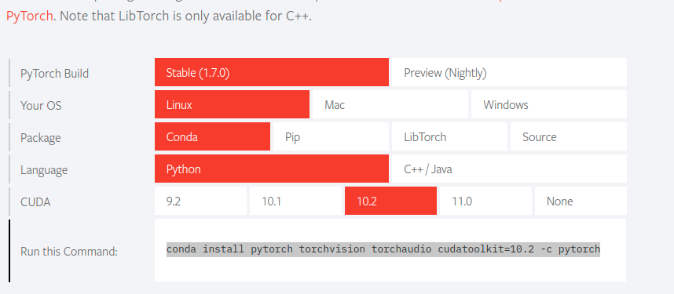

### Official Guideline to install Pytorch

https://pytorch.org/get-started/locally/

Anaconda - No CUDA

To install PyTorch via Anaconda, and do not have a CUDA-capable system or do not require CUDA, in the above selector, choose OS: Linux, Package: Conda and CUDA: None. Then, run the command that is presented to you.

**With CUDA** - THIS APPLIES TO ME

To install PyTorch via Anaconda, and you do have a CUDA-capable system, in the above selector, choose OS: Linux, Package: Conda and the CUDA version suited to your machine. Often, the latest CUDA version is better. Then, run the command that is presented to you.

#### Cuda enabled Pytorch installaion

Go to - https://pytorch.org/

And just follow the command



---

### Check the current installed version of pytorch by running below command in Terminal

```
python -c "import torch; print(torch.__version__)"
```

---

### Check if GPU is being used by pyTorch - run the below in a notebook

```python
import sys
import torch

print(f"PyTorch Version: {torch.__version__}")
print()
print(f"Python {sys.version}")
print("GPU is", "available" if torch.cuda.is_available() else "NOT AVAILABLE")

```

OUTPUT OF ABOVE

```
PyTorch Version: 1.7.0

Python 3.7.6 (default, Jan  8 2020, 19:59:22)
[GCC 7.3.0]
GPU is available

```

Following

https://github.com/jeffheaton/t81_558_deep_learning/blob/master/install/pytorch-install-jul-2020.ipynb
